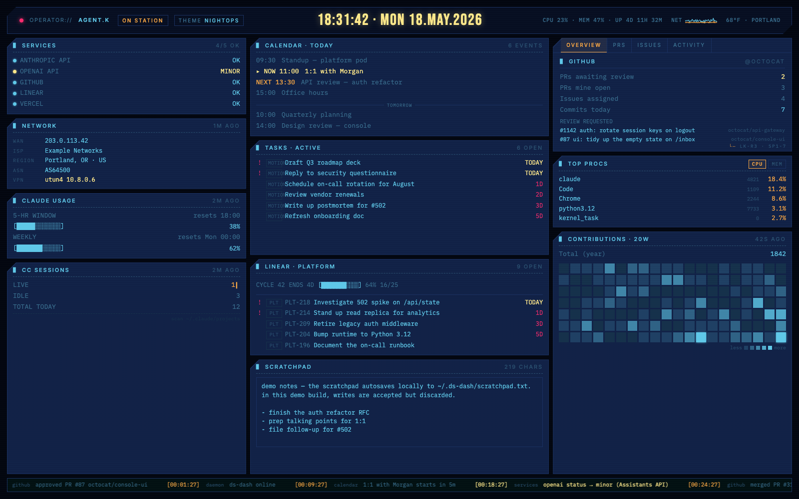
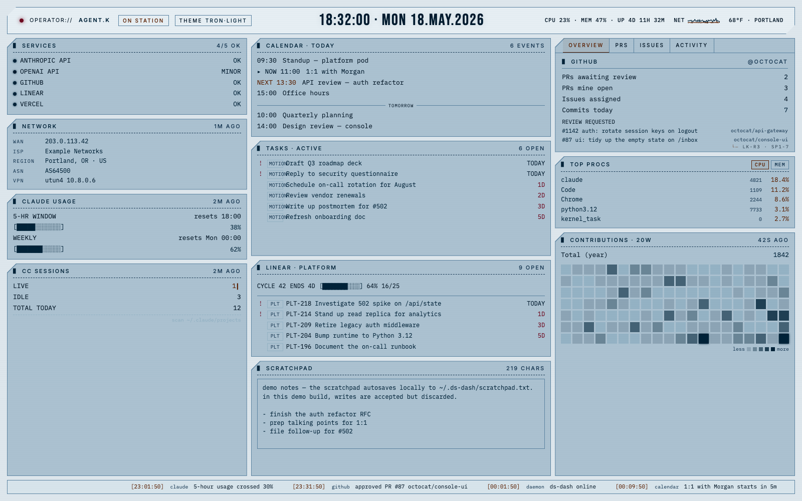

# ds-dash

A local personal dashboard. Cyberpunk-themed single-pane-of-glass for
GitHub, calendar, tasks, Linear, Claude Code usage, service status,
weather, and system stats. Runs as a small Python daemon on `localhost`;
the frontend is one static HTML page — no build step.

Requires Python 3.10+. macOS-first (calendar reads via `ical-buddy`,
Claude Code OAuth has a macOS Keychain fallback); on Linux the calendar
panel is unavailable and Claude usage needs
`~/.claude/.credentials.json` on disk. Everything else (GitHub, Motion,
Linear, services, system, network, weather, scratchpad) is
cross-platform.

## Screenshots

NIGHTOPS theme (default, dark):



TRON·LIGHT theme (one of five — cycle via the `THEME` chip or press `T`):



Shots are taken against a mock-data demo server — no real credentials,
no polling. You can run the same demo locally with
`python scripts/demo.py` (then open <http://localhost:7777>).

## Install + run

```bash
./run.sh
```

First run creates `.venv/`, installs deps, and copies a starter config
to `~/.ds-dash/config.toml`. The dashboard runs at
<http://localhost:7766> with the panels you've configured live and the
rest showing `OFFLINE` — you can run it with zero credentials and it
still surfaces services, system stats, network, and weather (after you
add a zip code).

To light up GitHub, the most popular panel, add a fine-grained personal
access token with read-only access to **Issues**, **Pull requests**, and
**Metadata** to the `[github]` block. See `config.example.toml` for the
full list of provider blocks.

## Network access

The daemon binds to `127.0.0.1` (loopback only) by default, so the
dashboard is reachable only from the host machine. To open it on another
device on your network — e.g. an iPad in the same room — set
`[server].host` in `~/.ds-dash/config.toml`:

```toml
[server]
port = 7766
host = "0.0.0.0"           # all interfaces (simplest)
# host = "192.168.1.42"    # or pin to one specific LAN IP
```

Then restart the daemon and open `http://<laptop-LAN-IP>:7766/` on the
other device.

> ⚠️ The dashboard has no authentication and surfaces private data
> (GitHub, calendar, Linear, Motion, scratchpad — the scratchpad endpoint
> is even writable). The daemon prints a startup warning whenever it
> binds to anything other than loopback. Use only on a trusted LAN.

## Optional setup

Everything below is optional — any provider whose credentials are missing
just shows `OFFLINE` and the rest of the dashboard works normally.

- **Calendar** (macOS) — `brew install ical-buddy`. Auto-detected once
  installed; no config needed unless `ical-buddy` lives somewhere other
  than `/opt/homebrew/bin`.
- **Tasks** (Motion) — set `[motion].api_key` in
  `~/.ds-dash/config.toml` (Motion → Settings → API & Integrations).
- **Linear** — add one `[[linear]]` block per workspace, each with a
  `label` and personal `api_key` (Linear → Settings → API).
- **Claude usage** — sign in to Claude Code (`claude` CLI). The daemon
  reads OAuth from `~/.claude/.credentials.json` or the
  `Claude Code-credentials` keychain item.
- **Network** — works without a token (free ipinfo.io tier, ~1k/day).
  Add `[network].ipinfo_token` for more headroom.
- **Weather** — set `[weather].zip` to a postal code (default country
  is `US`). No API key required — uses zippopotam.us + Open-Meteo.

See the providers table below for the full source/needs mapping.

## Providers

All panels read live data. Each provider polls on its own interval and
writes into a shared in-memory blob; the frontend fetches that blob every
5s. A provider whose credentials aren't configured shows an `OFFLINE`
chip rather than failing — you can run the dashboard with as few or as
many panels live as you like.

| panel          | source                                                                 | needs                            |
|----------------|------------------------------------------------------------------------|----------------------------------|
| GitHub         | api.github.com                                                         | fine-grained PAT                 |
| Service status | public status.json endpoints (Anthropic, OpenAI, GitHub, Linear, Vercel) | nothing                        |
| Calendar       | `ical-buddy` (macOS Calendar.app)                                      | `brew install ical-buddy` (macOS) |
| Tasks          | Motion API (`/v1/tasks`)                                               | Motion API key                   |
| Linear         | Linear GraphQL API (one panel per workspace)                           | personal API key per workspace   |
| Claude usage   | Anthropic rate-limit headers via 1-token probe; OAuth read from `~/.claude/.credentials.json` or `Claude Code-credentials` keychain item | Claude Code installed + signed in |
| CC sessions    | scan of `~/.claude/projects/**/*.jsonl`                                | Claude Code installed            |
| System stats   | `psutil` (CPU, mem, disk, net, processes)                              | nothing                          |
| Network        | local interfaces + ipinfo.io                                           | optional ipinfo token            |
| Weather        | zippopotam.us (geocode) + Open-Meteo (forecast)                        | postal code in config            |

The macOS Keychain access for Claude usage uses the standard `security`
CLI to read your own credentials — same item `claude` itself reads.
Nothing is written back.

## Customizing

- **Operator label** — set `[ui].operator_name` in
  `~/.ds-dash/config.toml` to change the `OPERATOR://NAME` header
  text. Falls back to `$USER` if unset.
- **Themes** — click the THEME chip in the header (or press `T`) to
  cycle: NIGHTOPS · TRON·DARK · TRON·LIGHT · CYBER·DARK · CYBER·LIGHT.
  Choice persists in `localStorage`.

## License

[Apache 2.0](LICENSE).

## Contributing

This is a personal-scratch dashboard, so the maintenance bar is low —
issues and small PRs are welcome but no SLAs implied. New providers
should follow the polling pattern documented in
[`CLAUDE.md`](CLAUDE.md); see [`CONTRIBUTING.md`](CONTRIBUTING.md) for
specifics. Security-sensitive reports: see
[`SECURITY.md`](SECURITY.md).

[`CLAUDE.md`](CLAUDE.md) and [`docs/FRONTEND.md`](docs/FRONTEND.md)
are written to double as instruction manuals for AI agents — adding a
new provider or theme via Claude Code (or Codex, Cursor, etc.) is
usually one prompt away from a working implementation. The provider
polling pattern, `STATE` shape, status vocabulary, ticker conventions,
and design tokens are all spelled out. Most of the existing providers
were built that way.

## Architecture

See [`CLAUDE.md`](CLAUDE.md) for the provider polling pattern, status
vocabulary, and how to add a new panel.
[`docs/FRONTEND.md`](docs/FRONTEND.md) covers layout, render
conventions, the NIGHTOPS design tokens, and responsive breakpoints.
